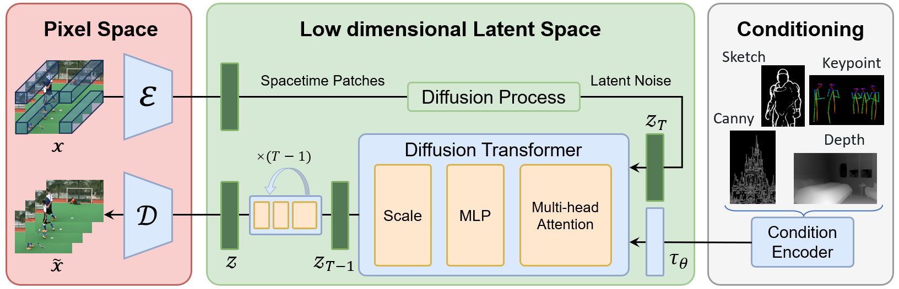
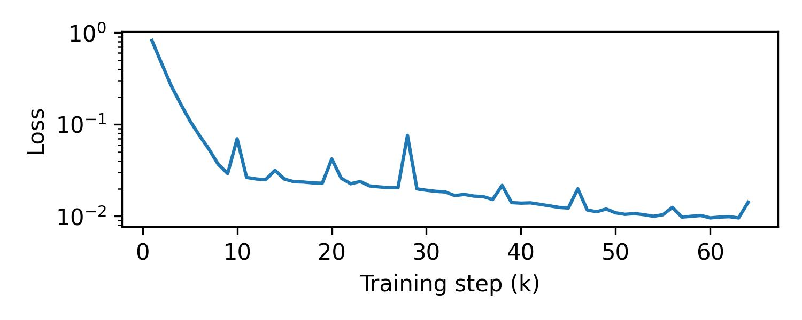

# Open-Sora Plan

[[Project Page]](https://pku-yuangroup.github.io/Open-Sora-Plan/) [[中文主页]](https://pku-yuangroup.github.io/Open-Sora-Plan/blog_cn.html)

This project aims to create a simple and scalable repo, to reproduce [Sora](https://openai.com/sora) (OpenAI, but we prefer to call it "CloseAI" ) and build knowledge about Video-VQVAE (VideoGPT) + DiT at scale. However, we have limited resources, we deeply wish all open-source community can contribute to this project. Pull request are welcome!!!

本项目希望通过开源社区的力量复现Sora，由北大-兔展AIGC联合实验室共同发起，当前我们资源有限仅搭建了基础架构，无法进行完整训练，希望通过开源社区逐步增加模块并筹集资源进行训练，当前版本离目标差距巨大，仍需持续完善和快速迭代，欢迎Pull request！！！
<p align="center">

</p>



  
## News
**[2024.03.01]** Training codes are available now! Learn more in our [project page](https://pku-yuangroup.github.io/Open-Sora-Plan/). Please feel free to watch 👀 this repository for the latest updates.

## Todo

- [x] support variable aspect ratios, resolutions, durations training
- [x] add class-conditioning on embeddings

- [ ] incorporating SiT
- [ ] dynamic mask input
- [ ] sampling script
- [ ] fine-tune Video-VQVAE on higher resolution
- [ ] incorporating more conditions
- [ ] training with more data and more GPU


## Requirements and Installation

The recommended requirements are as follows.

* Python >= 3.8
* Pytorch >= 1.13.1
* CUDA Version >= 11.7
* Install required packages:

```
git clone https://github.com/PKU-YuanGroup/Open-Sora-Plan
cd Open-Sora-Plan
conda create -n opensora python=3.8 -y
conda activate opensora
pip install torch==1.13.1+cu117 torchvision==0.14.1+cu117 torchaudio==0.13.1 --extra-index-url https://download.pytorch.org/whl/cu117
pip install -r requirements.txt
cd VideoGPT
pip install -e .
cd ..
```

## Usage

### Datasets

We test the code with UCF-101 dataset. In order to download UCF-101 dataset, you can download the necessary files in [here](https://www.crcv.ucf.edu/data/UCF101.php). The code assumes a `ucf101` directory with the following structure
```
UCF-101/
    ApplyEyeMakeup/
        v1.avi
        ...
    ...
    YoYo/
        v1.avi
        ...
```


### Video-VQVAE (VideoGPT)

#### Training

Refer to origin [repo](https://github.com/wilson1yan/VideoGPT?tab=readme-ov-file#training-vq-vae). Use the `scripts/train_vqvae.py` script to train a Video-VQVAE. Execute `python scripts/train_vqvae.py -h` for information on all available training settings. A subset of more relevant settings are listed below, along with default values.
```
cd VideoGPT
```

##### VQ-VAE Specific Settings
* `--embedding_dim`: number of dimensions for codebooks embeddings
* `--n_codes 2048`: number of codes in the codebook
* `--n_hiddens 240`: number of hidden features in the residual blocks
* `--n_res_layers 4`: number of residual blocks
* `--downsample 4 4 4`: T H W downsampling stride of the encoder

##### Training Settings
* `--gpus 2`: number of gpus for distributed training
* `--sync_batchnorm`: uses `SyncBatchNorm` instead of `BatchNorm3d` when using > 1 gpu
* `--gradient_clip_val 1`: gradient clipping threshold for training
* `--batch_size 16`: batch size per gpu
* `--num_workers 8`: number of workers for each DataLoader

##### Dataset Settings
* `--data_path <path>`: path to an `hdf5` file or a folder containing `train` and `test` folders with subdirectories of videos
* `--resolution 128`: spatial resolution to train on 
* `--sequence_length 16`: temporal resolution, or video clip length

#### Reconstructing

```Python
python VideoGPT/rec_video.py --video-path "assets/origin_video_0.mp4" --rec-path "rec_video_0.mp4" --num-frames 500 --sample-rate 1
```
```Python
python VideoGPT/rec_video.py --video-path "assets/origin_video_1.mp4" --rec-path "rec_video_1.mp4" --resolution 196 --num-frames 600 --sample-rate 1
```


We present four reconstructed videos in this demonstration, arranged from left to right as follows: 


| **3s 596x336** | **10s 256x256** | **18s 196x196**  | **24s 168x96** |
| --- | --- | --- | --- |
|   |   |   |  |

### VideoDiT (DiT)

#### Training
```
cd DiT
torchrun  --nproc_per_node=8 train.py \
  --model DiT-XL/122 --pt-ckpt DiT-XL-2-256x256.pt \
  --vae ucf101_stride4x4x4 \
  --data-path /remote-home/yeyang/UCF-101 --num-classes 101 \
  --sample-rate 2 --num-frames 8 --max-image-size 128 \
  --epochs 1400 --global-batch-size 256 --lr 1e-4 \
  --ckpt-every 1000 --log-every 1000 
```

<p align="center">

</p>

#### Sampling
Coming soon.

## Acknowledgement
* [DiT](https://github.com/facebookresearch/DiT/tree/main): Scalable Diffusion Models with Transformers.
* [VideoGPT](https://github.com/wilson1yan/VideoGPT): Video Generation using VQ-VAE and Transformers.
* [FiT](https://github.com/whlzy/FiT): Flexible Vision Transformer for Diffusion Model.
* [Positional Interpolation](https://arxiv.org/abs/2306.15595): Extending Context Window of Large Language Models via Positional Interpolation.

## License
* The service is a research preview intended for non-commercial use only. See [LICENSE.txt](LICENSE.txt) for details.

## Contributors

<a href="https://github.com/PKU-YuanGroup/Open-Sora-Plan/graphs/contributors">
  
</a>
