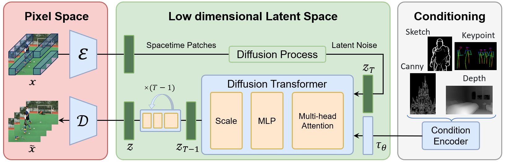
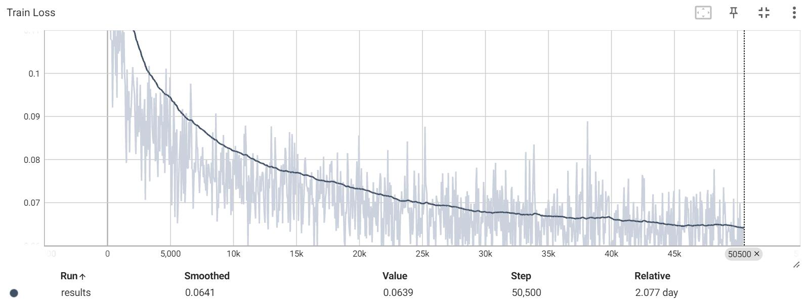

# Open-Sora Plan

[[Project Page]](https://pku-yuangroup.github.io/Open-Sora-Plan/) [[中文主页]](https://pku-yuangroup.github.io/Open-Sora-Plan/blog_cn.html)

[](https://discord.gg/f429rwHs)
[](https://github.com/PKU-YuanGroup/Open-Sora-Plan/issues/53#issuecomment-1987226516)
[](https://x.com/LinBin46984/status/1763476690385424554?s=20) <br>
[](https://github.com/PKU-YuanGroup/Open-Sora-Plan/blob/main/LICENSE) 
[](https://github.com/PKU-YuanGroup/Open-Sora-Plan/graphs/contributors) 
[](https://github.com/PKU-YuanGroup/Open-Sora-Plan/commits/main/)
[](https://github.com/PKU-YuanGroup/Open-Sora-Plan/pulls)
[](https://github.com/PKU-YuanGroup/Video-LLaVA/issues?q=is%3Aopen+is%3Aissue)
[](https://github.com/PKU-YuanGroup/Video-LLaVA/issues?q=is%3Aissue+is%3Aclosed) <br>
[](https://github.com/PKU-YuanGroup/Open-Sora-Plan/stargazers)&#160;
[](https://github.com/PKU-YuanGroup/Open-Sora-Plan/network)&#160;
[](https://github.com/PKU-YuanGroup/Open-Sora-Plan/watchers)&#160;
[](https://github.com/PKU-YuanGroup/Open-Sora-Plan/archive/refs/heads/main.zip)


## 💪 Goal
This project aims to create a simple and scalable repo, to reproduce [Sora](https://openai.com/sora) (OpenAI, but we prefer to call it "ClosedAI" ) and build knowledge about Video-VQVAE (VideoGPT) + DiT at scale. However, since we have limited resources, we deeply wish all open-source community can contribute to this project. Pull requests are welcome!!!

本项目希望通过开源社区的力量复现Sora，由北大-兔展AIGC联合实验室共同发起，当前我们资源有限仅搭建了基础架构，无法进行完整训练，希望通过开源社区逐步增加模块并筹集资源进行训练，当前版本离目标差距巨大，仍需持续完善和快速迭代，欢迎Pull request！！！

Project stages:
- Primary
1. Setup the codebase and train an un-conditional model on a landscape dataset.
2. Train models that boost resolution and duration.

- Extensions
3. Conduct text2video experiments on landscape dataset.
4. Train the 1080p model on video2text dataset.
5. Control model with more conditions.


<div style="display: flex; justify-content: center;"> 
   
   
</div>

  
## 📰 News

**[2024.03.27]** 🚀🚀🚀 We release the report of [VideoCausalVAE](docs/CausalVideoVAE.md), which supports both images and videos. We present our reconstructed video in this demonstration as follows. The text-to-video model is on the way.

https://github.com/qqingzheng/Open-Sora-Plan/assets/88202804/0dbf8f8f-efba-414e-ad42-1f839839f9cf


**[2024.03.10]** 🚀🚀🚀 This repo supports training a latent size of 225×90×90 (t×h×w), which means we are able to **train 1 minute of 1080P video with 30FPS** (2× interpolated frames and 2× super resolution) under class-condition.

**[2024.03.08]** We support the training code of text condition with 16 frames of 512x512. The code is mainly borrowed from [Latte](https://github.com/Vchitect/Latte).

**[2024.03.07]** We support training with 128 frames (when sample rate = 3, which is about 13 seconds) of 256x256, or 64 frames (which is about 6 seconds) of 512x512.

**[2024.03.05]** See our latest [todo](https://github.com/PKU-YuanGroup/Open-Sora-Plan?tab=readme-ov-file#todo), pull requests are welcome.

**[2024.03.04]** We re-organizes and modulizes our code to make it easy to [contribute](https://github.com/PKU-YuanGroup/Open-Sora-Plan?tab=readme-ov-file#how-to-contribute-to-the-open-sora-plan-community) to the project, to contribute please see the [Repo structure](https://github.com/PKU-YuanGroup/Open-Sora-Plan?tab=readme-ov-file#repo-structure).

**[2024.03.03]** We opened some [discussions](https://github.com/PKU-YuanGroup/Open-Sora-Plan/discussions) to clarify several issues.

**[2024.03.01]** Training code is available now! Learn more on our [project page](https://pku-yuangroup.github.io/Open-Sora-Plan/). Please feel free to watch 👀 this repository for the latest updates.


## ✊ Todo

#### Setup the codebase and train a unconditional model on landscape dataset
- [x] Fix typos & Update readme. 🤝 Thanks to [@mio2333](https://github.com/mio2333), [@CreamyLong](https://github.com/CreamyLong), [@chg0901](https://github.com/chg0901), [@Nyx-177](https://github.com/Nyx-177), [@HowardLi1984](https://github.com/HowardLi1984), [@sennnnn](https://github.com/sennnnn), [@Jason-fan20](https://github.com/Jason-fan20)
- [x] Setup environment. 🤝 Thanks to [@nameless1117](https://github.com/nameless1117)
- [ ] Add docker file. ⌛ [WIP] 🤝 Thanks to [@Mon-ius](https://github.com/Mon-ius), [@SimonLeeGit](https://github.com/SimonLeeGit)
- [ ] Enable type hints for functions. 🤝 Thanks to [@RuslanPeresy](https://github.com/RuslanPeresy), 🙏 **[Need your contribution]**
- [x] Resume from checkpoint.
- [x] Add Video-VQGAN model, which is borrowed from [VideoGPT](https://github.com/wilson1yan/VideoGPT).
- [x] Support variable aspect ratios, resolutions, durations training on [DiT](https://github.com/facebookresearch/DiT).
- [x] Support Dynamic mask input inspired by [FiT](https://github.com/whlzy/FiT).
- [x] Add class-conditioning on embeddings.
- [x] Incorporating [Latte](https://github.com/Vchitect/Latte) as main codebase.
- [x] Add VAE model, which is borrowed from [Stable Diffusion](https://github.com/CompVis/latent-diffusion).
- [x] Joint dynamic mask input with VAE.
- [ ] Add VQVAE from [VQGAN](https://github.com/CompVis/taming-transformers). 🙏 **[Need your contribution]**
- [ ] Make the codebase ready for the cluster training. Add SLURM scripts. 🙏 **[Need your contribution]**
- [x] Refactor VideoGPT. 🤝 Thanks to [@qqingzheng](https://github.com/qqingzheng), [@luo3300612](https://github.com/luo3300612), [@sennnnn](https://github.com/sennnnn)
- [x] Add sampling script.
- [ ] Add DDP sampling script. ⌛ [WIP]
- [x] Use accelerate on multi-node. 🤝 Thanks to [@sysuyy](https://github.com/sysuyy)
- [x] Incorporate [SiT](https://github.com/willisma/SiT). 🤝 Thanks to [@khan-yin](https://github.com/khan-yin)
- [x] Add evaluation scripts (FVD, CLIP score). 🤝 Thanks to [@rain305f](https://github.com/rain305f)

#### Train models that boost resolution and duration
- [x] Add [PI](https://arxiv.org/abs/2306.15595) to support out-of-domain size. 🤝 Thanks to [@jpthu17](https://github.com/jpthu17)
- [x] Add 2D RoPE to improve generalization ability as [FiT](https://github.com/whlzy/FiT). 🤝 Thanks to [@jpthu17](https://github.com/jpthu17)
- [x] Compress KV according to [PixArt-sigma](https://pixart-alpha.github.io/PixArt-sigma-project). 
- [x] Support deepspeed for videogpt training. 🤝 Thanks to [@sennnnn](https://github.com/sennnnn)
- [ ] Train a **low dimension** Video-AE, whether it is VAE or VQVAE. ⌛ [WIP] 🚀 **[Require more computation]**
- [x] Extract offline feature.
- [x] Train with offline feature.
- [x] Add frame interpolation model. 🤝 Thanks to [@yunyangge](https://github.com/yunyangge)
- [x] Add super resolution model. 🤝 Thanks to [@Linzy19](https://github.com/Linzy19)
- [x] Add accelerate to automatically manage training.
- [ ] Joint training with images. 🙏 **[Need your contribution]**
- [ ] Implement [MaskDiT](https://github.com/Anima-Lab/MaskDiT) technique for fast training. 🙏 **[Need your contribution]**
- [ ] Incorporate [NaViT](https://arxiv.org/abs/2307.06304). 🙏 **[Need your contribution]**
- [ ] Add [FreeNoise](https://github.com/arthur-qiu/FreeNoise-LaVie) support for training-free longer video generation. 🙏 **[Need your contribution]**

#### Conduct text2video experiments on landscape dataset.
- [ ] Implement [PeRFlow](https://github.com/magic-research/piecewise-rectified-flow) for improving the sampling process. 🙏 **[Need your contribution]**
- [x] Finish data loading, pre-processing utils.
- [x] Add T5 support. 
- [x] Add CLIP support. 🤝 Thanks to [@Ytimed2020](https://github.com/Ytimed2020)
- [x] Add text2image training script.
- [ ] Add prompt captioner. 
  - [ ] Collect training data.
    - [ ] Need video-text pairs with caption. 🙏 **[Need your contribution]**
    - [ ] Extract multi-frame descriptions by large image-language models. 🤝 Thanks to [@HowardLi1984](https://github.com/HowardLi1984)
    - [ ] Extract video description by large video-language models. 🙏 **[Need your contribution]**
    - [ ] Integrate captions to get a dense caption by using a large language model, such as GPT-4. 🤝 Thanks to [@HowardLi1984](https://github.com/HowardLi1984)
  - [ ] Train a captioner to refine captions. 🚀 **[Require more computation]**

#### Train the 1080p model on video2text dataset
- [ ] Looking for a suitable dataset, welcome to discuss and recommend. 🙏 **[Need your contribution]**
- [ ] Add synthetic video created by game engines or 3D representations. 🙏 **[Need your contribution]**
- [x] Finish data loading, and pre-processing utils. ⌛ [WIP]
- [ ] Support memory friendly training.
  - [x] Add flash-attention2 from pytorch.
  - [x] Add xformers.  🤝 Thanks to [@jialin-zhao](https://github.com/jialin-zhao)
  - [x] Support mixed precision training.
  - [x] Add gradient checkpoint.
  - [x] Support for ReBased and Ring attention. 🤝 Thanks to [@kabachuha](https://github.com/kabachuha)
  - [x] Train using the deepspeed engine. 🤝 Thanks to [@sennnnn](https://github.com/sennnnn)
  - [ ] Integrate with [Colossal-AI](https://github.com/PKU-YuanGroup/Open-Sora-Plan/issues/59#issue-2170735221) for a cheaper, faster, and more efficient. 🙏 **[Need your contribution]**
- [ ] Train with a text condition. Here we could conduct different experiments: 🚀 **[Require more computation]**
  - [ ] Train with T5 conditioning.
  - [ ] Train with CLIP conditioning.
  - [ ] Train with CLIP + T5 conditioning (probably costly during training and experiments).

#### Control model with more condition
- [x] Load pretrained weights from [Latte](https://github.com/Vchitect/Latte).
- [ ] Incorporating [ControlNet](https://github.com/lllyasviel/ControlNet). 🙏 **[Need your contribution]**

## 📂 Repo structure (WIP)
```
├── README.md
├── docs
│   ├── Data.md                    -> Datasets description.
│   ├── Contribution_Guidelines.md -> Contribution guidelines description.
├── scripts                        -> All scripts.
├── opensora
│   ├── dataset
│   ├── models
│   │   ├── ae                     -> Compress videos to latents
│   │   │   ├── imagebase
│   │   │   │   ├── vae
│   │   │   │   └── vqvae
│   │   │   └── videobase
│   │   │       ├── vae
│   │   │       └── vqvae
│   │   ├── captioner
│   │   ├── diffusion              -> Denoise latents
│   │   │   ├── diffusion         
│   │   │   ├── dit
│   │   │   ├── latte
│   │   │   └── unet
│   │   ├── frame_interpolation
│   │   ├── super_resolution
│   │   └── text_encoder
│   ├── sample
│   ├── train                      -> Training code
│   └── utils
```

## 🛠️ Requirements and Installation

1. Clone this repository and navigate to Open-Sora-Plan folder
```
git clone https://github.com/PKU-YuanGroup/Open-Sora-Plan
cd Open-Sora-Plan
```
2. Install required packages
```
conda create -n opensora python=3.8 -y
conda activate opensora
pip install -e .
```
3. Install additional packages for training cases
```
pip install -e ".[train]"
pip install flash-attn --no-build-isolation
```
4. Install optional requirements such as static type checking:
```
pip install -e '.[dev]'
```

## 🗝️ Usage

### Datasets
Refer to [Data.md](docs/Data.md)

###  Evaluation
Refer to the document [EVAL.md](docs/EVAL.md).

### Causal Video VAE

#### Reconstructing

```Python
python examples/rec_video_vae.py --rec-path test_video.mp4 --video-path video.mp4 --resolution 512 --num-frames 1440 --sample-rate 1 --sample-fps 24 -
-device cuda --ckpt <Your ckpt>
```

For more details, please refer to: [CausalVideoVAE Report](docs/CausalVideoVAE.md).

### VideoGPT VQVAE

Please refer to the document [VQVAE](docs/VQVAE.md).

### Video Diffusion Transformer

#### Training
```
sh scripts/train.sh
```

The current resources are only enough for us to do primary experiments on the Sky dataset. 

<p align="center">

</p>

#### Sampling
```
sh scripts/sample.sh
```

Below is a visualization of the sampling results.

| **12s 256x256** | **25s 256x256** |
| --- | --- |
|   |   |

## 🚀 Improved Training Performance

In comparison to the original implementation, we implement a selection of training speed acceleration and memory saving features including gradient checkpointing, mixed precision training, and pre-extracted features, xformers, deepspeed. Some data points using **a batch size of 1 with a A100**:
 
### 64×32×32 (origin size: 256×256×256)

| gradient checkpointing | mixed precision | xformers | feature pre-extraction | deepspeed config | compress kv | training speed | memory       |
|:----------------------:|:---------------:|:--------:|:----------------------:|:----------------:|:--------------:|:------------:|:------------:|
| ✔                     | ✔               | ✔        | ✔                     | ❌               | ❌            |0.64 steps/sec  |   43G        |
| ✔                     | ✔               | ✔        | ✔                     | Zero2             | ❌            |0.66 steps/sec  |   14G        |
| ✔                     | ✔               | ✔        | ✔                     | Zero2             | ✔             |0.66 steps/sec  |   15G        |
| ✔                     | ✔               | ✔        | ✔                     | Zero2 offload     | ❌            |0.33 steps/sec  |   11G        |
| ✔                     | ✔               | ✔        | ✔                     | Zero2 offload     | ✔             |0.31 steps/sec  |   12G        |

### 128×64×64 (origin size: 512×512×512)

| gradient checkpointing | mixed precision | xformers | feature pre-extraction | deepspeed config | compress kv | training speed | memory       |
|:----------------------:|:---------------:|:--------:|:----------------------:|:----------------:|:--------------:|:------------:|:------------:|
| ✔                     | ✔               | ✔        | ✔                     | ❌               | ❌            |0.08 steps/sec  |   77G        |
| ✔                     | ✔               | ✔        | ✔                     | Zero2             | ❌            |0.08 steps/sec  |   41G        |
| ✔                     | ✔               | ✔        | ✔                     | Zero2             | ✔             |0.09 steps/sec  |   36G        |
| ✔                     | ✔               | ✔        | ✔                     | Zero2 offload     | ❌            |0.07 steps/sec  |   39G        |
| ✔                     | ✔               | ✔        | ✔                     | Zero2 offload     | ✔             |0.07 steps/sec  |   33G        |

## 💡 How to Contribute to the Open-Sora Plan Community
We greatly appreciate your contributions to the Open-Sora Plan open-source community and helping us make it even better than it is now!

For more details, please refer to the [Contribution Guidelines](docs/Contribution_Guidelines.md)


## 👍 Acknowledgement
* [Latte](https://github.com/Vchitect/Latte): The **main codebase** we built upon and it is an wonderful video gererated model.
* [VideoGPT](https://github.com/wilson1yan/VideoGPT): Video Generation using VQ-VAE and Transformers.
* [DiT](https://github.com/facebookresearch/DiT): Scalable Diffusion Models with Transformers.
* [FiT](https://github.com/whlzy/FiT): Flexible Vision Transformer for Diffusion Model.
* [Positional Interpolation](https://arxiv.org/abs/2306.15595): Extending Context Window of Large Language Models via Positional Interpolation.


## 🔒 License
* See [LICENSE](LICENSE) for details.

<!--
## ✨ Star History

[](https://star-history.com/#PKU-YuanGroup/Open-Sora-Plan&Date)
-->

## 🤝 Community contributors

<a href="https://github.com/PKU-YuanGroup/Open-Sora-Plan/graphs/contributors">
  
</a>
