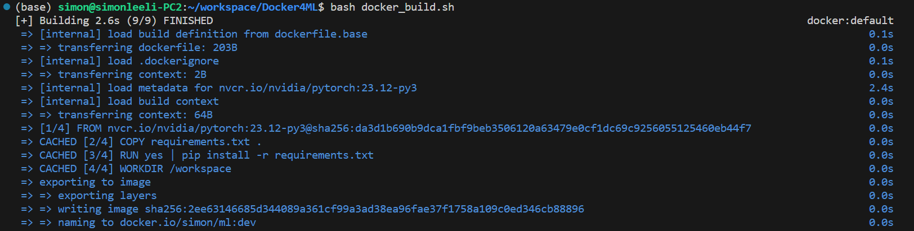
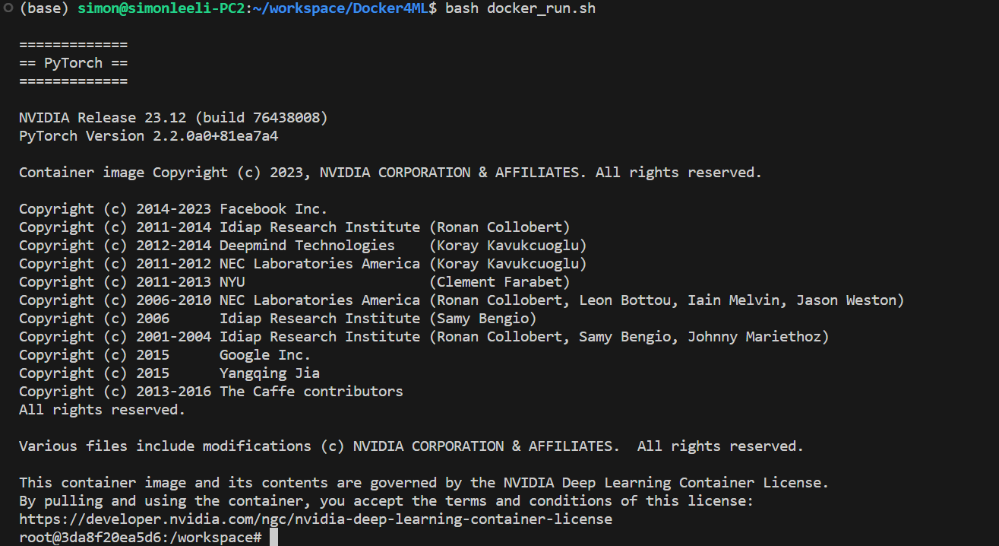

# Docker4ML

Useful docker scripts for ML development.
[https://github.com/SimonLeeGit/Docker4ML](https://github.com/SimonLeeGit/Docker4ML)

## Build Docker Image

```bash
bash docker_build.sh
```



## Run Docker Container as Development Environment

```bash
bash docker_run.sh
```



## Custom Docker Config

### Config [setup_env.sh](./setup_env.sh)

You can modify this file to custom your settings.

```bash
TAG=ml:dev
BASE_TAG=nvcr.io/nvidia/pytorch:23.12-py3
```

#### TAG

Your built docker image tag, you can set it as what you what.

#### BASE_TAG

The base docker image tag for your built docker image, here we use nvidia pytorch images.
You can check it from [https://catalog.ngc.nvidia.com/orgs/nvidia/containers/pytorch/tags](https://catalog.ngc.nvidia.com/orgs/nvidia/containers/pytorch/tags)

Also, you can use other docker image as base, such as: [ubuntu](https://hub.docker.com/_/ubuntu/tags)

### USER_NAME

Your user name used in docker container.

### USER_PASSWD

Your user password used in docker container.

### Config [requirements.txt](./requirements.txt)

You can add your default installed python libraries here.

```txt
transformers==4.27.1
```

By default, it has some libs installed, you can check it from [https://docs.nvidia.com/deeplearning/frameworks/pytorch-release-notes/rel-24-01.html](https://docs.nvidia.com/deeplearning/frameworks/pytorch-release-notes/rel-24-01.html)

### Config [packages.txt](./packages.txt)

You can add your default apt-get installed packages here.

```txt
wget
curl
git
```

### Config [ports.txt](./ports.txt)

You can add some ports enabled for docker container here.

```txt
-p 6006:6006
-p 8080:8080
```

### Config [postinstallscript.sh](./postinstallscript.sh)

You can add your custom script to run when build docker image.

## Q&A

If you have any use problems, please contact to <simonlee235@gmail.com>.
