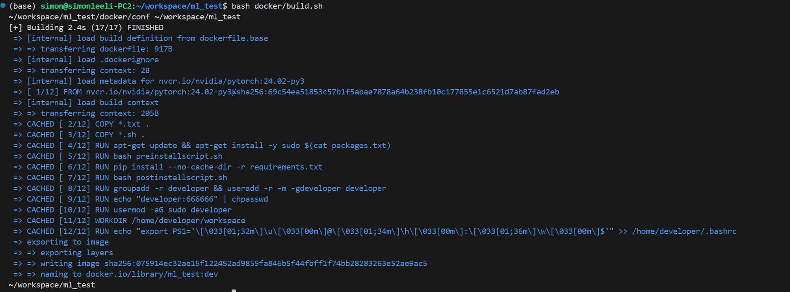
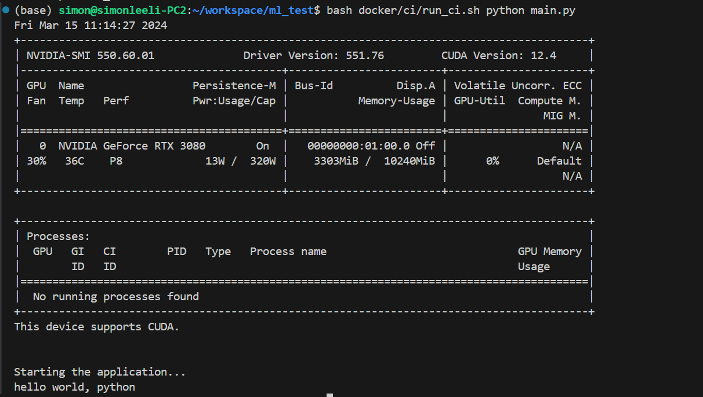

# Docker4ML

[](https://github.com/SimonLeeGit/Docker4ML/blob/main/LICENSE)


Project Repository: [https://github.com/SimonLeeGit/Docker4ML](https://github.com/SimonLeeGit/Docker4ML)

Useful docker scripts for ML developement. You can integrated to your project in the **docker** folder.


## Build Docker Image

You can build your development docker image as below.

```bash
bash docker/build.sh
```



## Run Docker Container as Development Envirnoment

You can run built development docker container as your development environment as below.

```bash
bash docker/run.sh
```


## Custom Docker Config

### Config [setup_env.sh](./conf/setup_env.sh)

You can modify this file to custom your settings.

```bash
# Docker tag for new build image
TAG=cuda:dev
CI_TAG=cuda:ci

# Base docker image tag used by docker build
BASE_IMG=nvcr.io/nvidia/cuda:12.3.2-runtime-ubuntu22.04

# User password used in docker container
USER_PASSWD=666666
```

#### TAG

Your built docker image tag, you can set it as what you what.

#### CI_TAG

Your bult docker image tag for ci usage, you can set it as what you what.

#### BASE_IMG

The base docker image tag for your built docker image, here we use nvidia pytorch images.
You can check it from [hhttps://catalog.ngc.nvidia.com/orgs/nvidia/containers/cuda/tags](https://catalog.ngc.nvidia.com/orgs/nvidia/containers/cuda/tags)

#### USER_PASSWD

Your user password used in docker container, your user name will keep according with your host user name.

### Config [requriements.txt](./conf/requirements.txt)

You can add your default installed python libraries here.

```txt
torch==2.0.1
transformers==4.32.0
matplotlib==3.7.5
numpy==1.24.4
pandas==2.0.3
tensorboard==2.14.0
```

### Config [packages.txt](./conf/packages.txt)

You can add your default apt-get installed packages here.

```txt
python3
python3-pip
wget
```

### Config [ports.txt](./conf/ports.txt)

You can add some ports enabled for docker container here.

```txt
-p 6006:6006
-p 8080:8080
```

### Config [*installscript.sh]

- [preinstallscript.sh](./conf/preinstallscript.sh): executed before pip installation
- [postinstallscript.sh](./conf/postinstallscript.sh): executed after pip installation

You can add your custom script to run when build docker image.

## GitHub WorkFlow Support

You can add github workflow by copy [docker_build_ci.yaml](./docker_build_ci.yml) to the path **.github/workflows/** in your github repo.

Then, you should set DOCKER_USERNAME and DOCKER_ACCESS_TOKEN in GitHub settings.


Finally, you can check the actions for the workflow result.


Alos, you can build your CI docker image in local machine.

### Build CI Docker Image

You can also build a CI docker image for your app to be runned at cloud environment.

```bash
bash docker/ci/build_ci.sh -d <project_dir>
```


### Run CI Docker Container at cloud envirnoment

```bash
bash docker/ci/run_ci.sh <cmd>

# <cmd> is your custom command to be runned in CI docker container, such as:
#
# bash docker/ci/run_ci.sh echo "hello world"
# bash docker/ci/run_ci.sh bash main.sh
# bash docker/ci/run_ci.sh python main.py
```



## Q&A

If you have any use problems, please contact to <simonlee235@gmail.com>.
