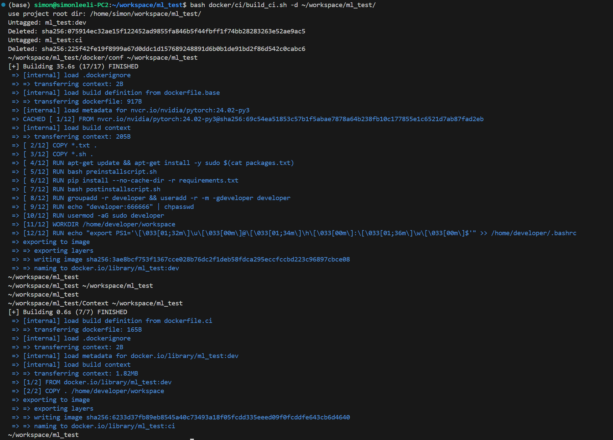

# Docker4ML

[](https://github.com/SimonLeeGit/Docker4ML/blob/main/LICENSE)


Useful docker scripts for ML developement.
[https://github.com/SimonLeeGit/Docker4ML](https://github.com/SimonLeeGit/Docker4ML)

## Build Docker Image

You can build your development docker image as below.

```bash
bash build.sh
```


## Run Docker Container as Development Envirnoment

You can run built development docker container as your development environment as below.

```bash
bash run.sh
```


## Build CI Docker Image

You can also build a CI docker image for your app to be runned at cloud environment.

```bash
bash build_ci.sh
```

Or, you can build with a valid DOCKER_USERNAME

```bash
bash build_ci.sh -u <DOCKER_USERNAME>
```



## Run CI Docker Container at cloud envirnoment

```bash
bash run_ci.sh <cmd>

# <cmd> is your custom command to be runned in CI docker container, such as:
#
# bash run_ci.sh echo "hello world"
# bash run_ci.sh python test.py, the work dir is your git repo root
```

Or, you can build with a valid DOCKER_USERNAME

```bash
bash run_ci.sh -u <DOCKER_USERNAME> <cmd>
```


## Push CI Docker Image to docker hub

Sometimes, you need to push your built docker image to docker hub.
But, you need docker login first. There two ways about this.

### Way1: Docker Login from terminal

```bash
docker login --username <DOCKER_USERNAME>
# here, you need to input with your password!
```

### Way2: Auto Login by Github workflow for CI

You need to set the secrete by GitHub settings for DOCKER_USERNAME and DOCKER_ACCESS_TOKEN

```yaml
      - name: Log in to Docker Hub
        uses: docker/login-action@f4ef78c080cd8ba55a85445d5b36e214a81df20a
        with:
          username: ${{ secrets.DOCKER_USERNAME }}
          password: ${{ secrets.DOCKER_ACCESS_TOKEN }}
```

Then, you can push docker image to docker hub as below.

```bash
bash push_ci.sh -u <DOCKER_USERNAME>
```

## Custom Docker Config

### Config [setup_env.sh](./conf/setup_env.sh)

You can modify this file to custom your settings.

```bash
# Docker tag for new build image
TAG=cuda:dev
CI_TAG=cuda:ci

# Base docker image tag used by docker build
BASE_IMG=nvcr.io/nvidia/cuda:12.3.2-runtime-ubuntu22.04

# User name used in docker container
USER_NAME=developer

# User password used in docker container
USER_PASSWD=666666

# Git repo for CI docker image
GIT_REPO=https://github.com/SimonLeeGit/Docker4ML.git

# Git branch for CI docker image
GIT_BRANCH=main
```

#### TAG

Your built docker image tag, you can set it as what you what.

#### CI_TAG

Your bult docker image tag for ci usage, you can set it as what you what.

#### BASE_IMG

The base docker image tag for your built docker image, here we use nvidia pytorch images.
You can check it from [hhttps://catalog.ngc.nvidia.com/orgs/nvidia/containers/cuda/tags](https://catalog.ngc.nvidia.com/orgs/nvidia/containers/cuda/tags)

#### USER_NAME

Your user name used in docker container.

#### USER_PASSWD

Your user password used in docker container.

#### GIT_REPO

For ci docker image, you need to set a valid git repo, in order to copy your runnable packages into the ci docker image.

#### GIT_BRANCH

For ci docker image, you need to set a valid git branch to clone your runnable package from your git repo.

### Config [requriements.txt](./conf/requirements.txt)

You can add your default installed python libraries here.

```txt
torch==2.0.1
transformers==4.32.0
matplotlib==3.7.5
numpy==1.24.4
pandas==2.0.3
tensorboard==2.14.0
```

By default, it has some libs installed, you can check it from [https://docs.nvidia.com/deeplearning/frameworks/pytorch-release-notes/rel-24-01.html](https://docs.nvidia.com/deeplearning/frameworks/pytorch-release-notes/rel-24-01.html)

### Config [packages.txt](./conf/packages.txt)

You can add your default apt-get installed packages here.

```txt
python3
python3-pip
wget
```

### Config [ports.txt](./conf/ports.txt)

You can add some ports enabled for docker container here.

```txt
-p 6006:6006
-p 8080:8080
```

### Config [*installscript.sh]

- [preinstallscript.sh](./conf/preinstallscript.sh): executed before pip installation
- [postinstallscript.sh](./conf/postinstallscript.sh): executed after pip installation

You can add your custom script to run when build docker image.

## GitHub WorkFlow Support

You can add github workflow by copy [docker_build_ci.yaml](./docker_build_ci.yml) to the path **.github/workflows/** in your github repo.

## Q&A

If you have any use problems, please contact to <simonlee235@gmail.com>.
